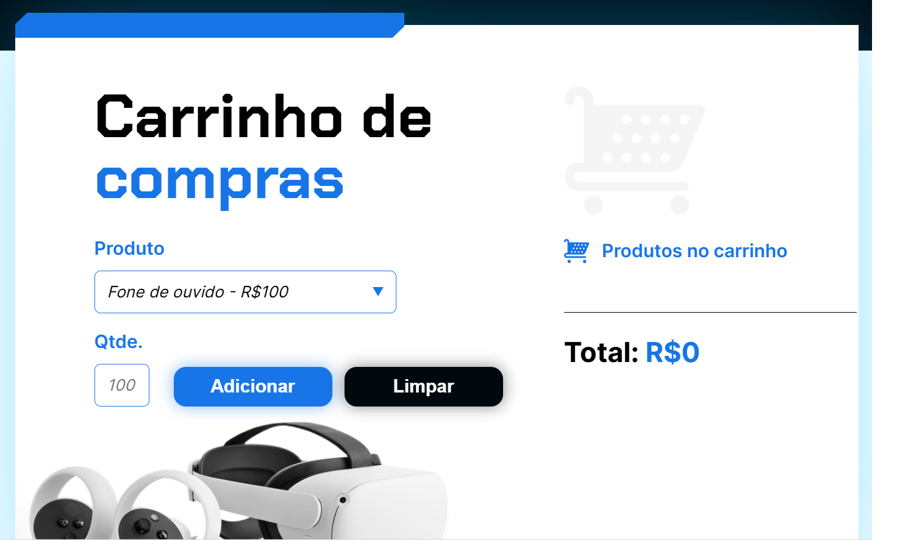

# Marketplace

Marketplace é um carrinho de compras online. Apeans ilustrativos e sem fins comerciais.

## 🔨 Funcionalidades do projeto

Temos um projeto que foi idealizada com o objetivo de especializar em javascript.  
Apenas para versão desktop.

## ✔️ Técnicas e tecnologias utilizadas

-`HTML`
-`CSS`
-`Javascript`
-`Acessibilidade Web`

## 🛠️ Abrir e rodar o projeto

Para abrir e rodar o projeto, utilize um editor de código de sua escolha.
Depois, abra o projeto no seu navegador.

## VERCEL 

